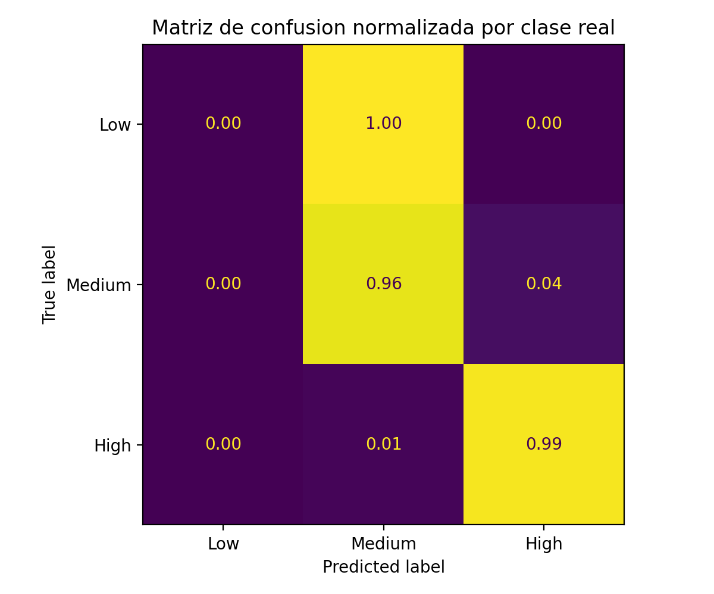
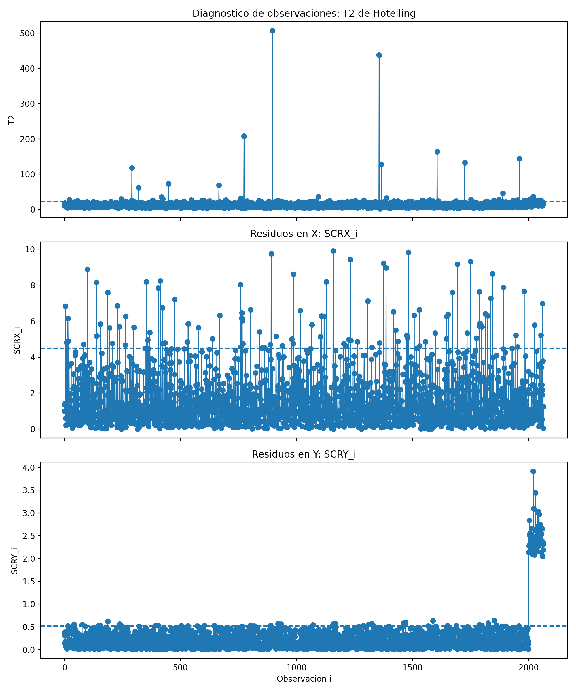
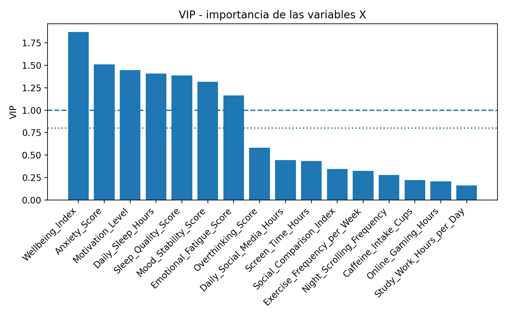

# Multivariate Process Monitoring and PLS-DA

Separate public block built from the coursework folder `ANALISIS Y MONITORIZACION DE PROCESOS MULTIVARIANTES`.

## Technical focus

- correlation structure inspection;
- latent-variable process views;
- PCA-style monitoring interpretation;
- PLS-DA diagnostics;
- cross-validation and permutation-based assessment;
- class-oriented performance visualization.

## Public material

- `figures/`
- `docs/plsda_summary.md`

The figures in this folder are safe rendered outputs selected for portfolio use. They document the type of monitoring and diagnostic analysis carried out in the original project without exposing the raw workbooks that powered the notebooks.

## Figure highlights

- cross-validation metrics across latent components;
- normalized confusion-matrix view;
- residual monitoring diagnostics;
- VIP-based variable-importance analysis;
- correlation-structure views used to frame the monitoring problem.

## Visual preview

## Not included directly

The original notebook versions that drove this block were not copied into the repository as runnable files because they still depend on local workbooks and generated local references. The public repository keeps the figures and technical summary instead of publishing a path-bound notebook bundle.

## Why this block is labelled PLS-DA

The public narrative intentionally names this block around `PLS-DA` because that is the core discriminant component of the reviewed project material. The repository does not present it as generic multivariate analysis: it is a separate monitoring-and-diagnostics block with explicit class-oriented modelling.
