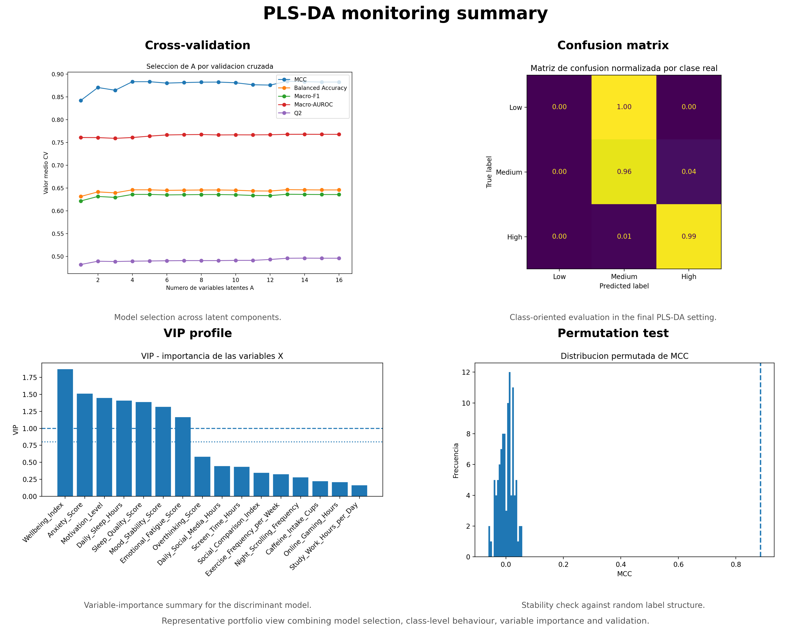

# Multivariate Process Monitoring and PLS-DA

In this block I focus on the coursework folder `ANALISIS Y MONITORIZACION DE PROCESOS MULTIVARIANTES`.

## Technical focus

- correlation structure inspection;
- latent-variable process views;
- PCA-style monitoring interpretation;
- PLS-DA diagnostics;
- cross-validation and permutation-based assessment;
- class-oriented performance visualization.

## Public material

- `figures/`
- `docs/plsda_summary.md`
- `notebooks/plsda_monitoring_summary.ipynb`
- `src/build_plsda_summary_panel.py`
- `rf-vs-plsda-delivery/`
  Clean delivery package centered only on `Random Forest` and `PLS-DA`, with a public synthetic dataset, Python code, generated figures and a short submission notebook.

The figures in this folder are safe rendered outputs that I selected for portfolio use. They document the type of monitoring and diagnostic analysis I carried out in the original project without exposing the raw workbooks that powered the notebooks.

## Figure highlights

- cross-validation metrics across latent components;
- normalized confusion-matrix view;
- residual monitoring diagnostics;
- VIP-based variable-importance analysis;
- correlation-structure views used to frame the monitoring problem.

## Visual preview

## Not included directly

I did not copy the original notebook versions that drove this block into the repository as runnable files because they still depend on local workbooks and generated local references. Here I keep the figures and the technical summary instead of publishing a path-bound notebook bundle.

## Why this block is labelled PLS-DA

I intentionally name this block around `PLS-DA` because that is the core discriminant component of the project material. I do not present it as generic multivariate analysis: it is a separate monitoring-and-diagnostics block with explicit class-oriented modelling.
